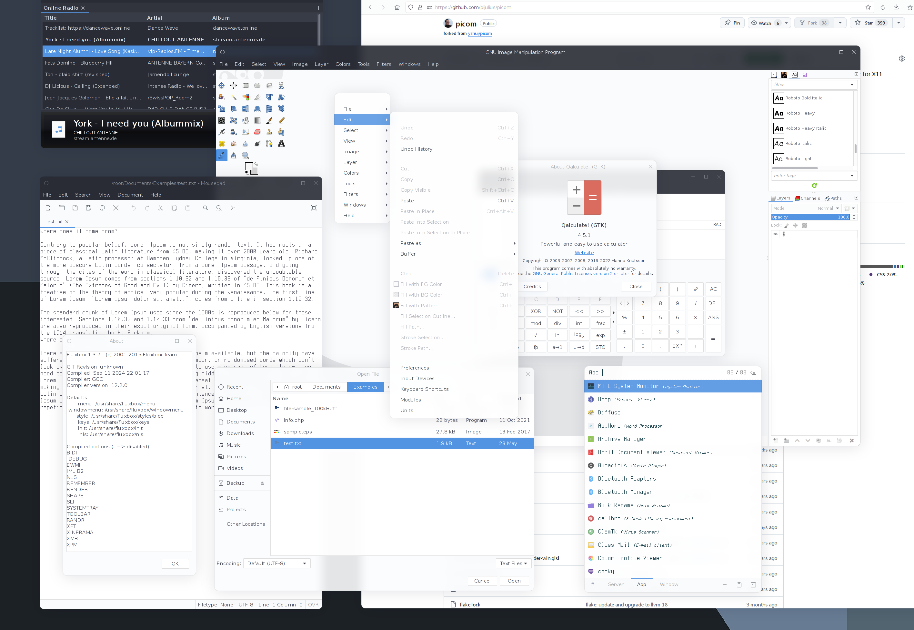

<div align="center">

# ✨ picom-fork

### Um fork do **picom** com foco em animações fluidas, presets modernos e uma configuração completa para desktops X11.

[](https://github.com/fcanatta5/picom-fork)
[](https://github.com/fcanatta5/picom-fork)
[](https://mesonbuild.com/)
[](https://www.x.org/)
[](#-licença)

</div>

---

## 📌 Sobre

**picom-fork** é um fork experimental do compositor **picom** para **X11**, com foco em:

- animações de abertura, fechamento, troca de workspace, resize/move e opacidade;
- presets de animação prontos para uso;
- correções no parser de animações;
- suporte melhorado ao alias `geometry`;
- configuração completa, comentada e pronta para customização;
- integração com builds Meson/Ninja e empacotamento para Arch Linux via `PKGBUILD`.

Este projeto é indicado para quem usa ambientes como **i3**, **bspwm**, **Openbox**, **AwesomeWM**, **dwm**, **XFCE em X11** ou outros window managers baseados em X11 e quer um compositor com visual mais moderno.

> [!IMPORTANT]
> Este compositor é para **X11**. Ele não substitui o compositor nativo de ambientes Wayland como Hyprland, Sway, GNOME Wayland ou KDE Wayland.

---

## 🖼️ Preview

Se o arquivo estiver presente no repositório, o GitHub renderiza a imagem abaixo automaticamente:

<p align="center">
  
</p>

---

## ✨ Recursos principais

### 🎞️ Animações

O fork inclui animações para eventos comuns de janelas:

| Evento | Descrição |
|---|---|
| `open` | janela criada/mapeada |
| `close` | janela fechada/destruída |
| `show` | janela reaparece |
| `hide` | janela é ocultada |
| `increase-opacity` | opacidade aumenta |
| `decrease-opacity` | opacidade diminui |
| `workspace-in` | janela entra na troca de workspace |
| `workspace-out` | janela sai na troca de workspace |
| `workspace-in-inverse` | entrada inversa de workspace |
| `workspace-out-inverse` | saída inversa de workspace |
| `geometry` | alias para `size` + `position` |
| `size` | mudança de tamanho |
| `position` | mudança de posição |
| `color` | mudança de cor da sombra |

### 🧩 Presets disponíveis

A configuração suporta presets clássicos e uma nova camada **Hyprland-like** implementada no parser de presets:

| Preset | Uso recomendado |
|---|---|
| `hypr-open` / `hypr-popin` | abertura com pop-in, fade, blur e overshoot leve, próximo ao `windows`/`popin` do Hyprland |
| `hypr-close` / `hypr-popout` | fechamento rápido com pop-out e curva ease-in |
| `hypr-fade-in` | transição curta para aumento de opacidade |
| `hypr-fade-out` | transição curta para redução de opacidade |
| `hypr-workspace-in` | entrada de workspace com slide curto, escala sutil e fade |
| `hypr-workspace-out` | saída de workspace com slide curto, escala sutil e fade |
| `hypr-geometry` / `hypr-move` | move/resize com curva spring visual e blend do frame salvo |
| `appear` / `disappear` | entrada/saída suave clássica com escala e fade |
| `zoom-in` / `zoom-out` | abertura/fechamento rápidos clássicos |
| `pop-in` / `pop-out` | pop clássico para splash screens e diálogos |
| `slide-*-in/out` | entrada/saída direcional curta |
| `fly-*-in/out` | entrada/saída direcional mais longa |
| `geometry-change`, `geometry-fast`, `geometry-smooth`, `move-smooth` | presets clássicos de resize/move |


---

## 🚀 Instalação

### Arch Linux usando PKGBUILD

Clone o repositório do pacote ou coloque o `PKGBUILD` em um diretório de build:

```bash
git clone https://github.com/fcanatta5/picom-fork.git
cd picom-fork
```

Se você estiver usando um `PKGBUILD` separado para empacotar este fork:

```bash
mkdir -p ~/build/picom-fork-git
cp PKGBUILD ~/build/picom-fork-git/
cd ~/build/picom-fork-git
makepkg -Csi
```

Depois da instalação, confira os arquivos instalados:

```bash
pacman -Ql picom-fork-git | grep -E 'picom|conf|doc'
```

### Build manual com Meson

Instale as dependências principais no Arch:

```bash
sudo pacman -S --needed \
  base-devel git meson ninja asciidoctor uthash xorgproto \
  libconfig dbus libev pcre2 pixman \
  xcb-util-image xcb-util-renderutil libepoxy mesa
```

Clone e compile:

```bash
git clone https://github.com/fcanatta5/picom-fork.git
cd picom-fork

meson setup build \
  -Dwith_docs=true \
  -Ddbus=true \
  -Dopengl=true \
  -Dregex=true \
  -Dcompton=true \
  -Dunittest=false

meson compile -C build
sudo meson install -C build
```

---

## ⚙️ Como usar a configuração animada

O arquivo principal deste fork é:

```text
picom.full-animated.conf
```

Copie para a configuração do usuário:

```bash
mkdir -p ~/.config/picom
cp picom.full-animated.conf ~/.config/picom/picom.conf
```

Se você instalou pelo pacote Arch, o arquivo pode estar em:

```bash
/usr/share/doc/picom/picom.full-animated.conf
```

Nesse caso:

```bash
mkdir -p ~/.config/picom
cp /usr/share/doc/picom/picom.full-animated.conf ~/.config/picom/picom.conf
```

Execute:

```bash
picom --config ~/.config/picom/picom.conf
```

Para reiniciar se já houver outro `picom` rodando:

```bash
pkill picom
picom --config ~/.config/picom/picom.conf &
```

Para debug:

```bash
picom --config ~/.config/picom/picom.conf --log-level=debug
```

---

## 🧠 Exemplo de configuração de animação

```conf
animations = (
{
  triggers = ["open", "show"];
  suppressions = ["close", "hide"];
  preset = "hypr-open";
  duration = 0.22;
  scale = 0.84;
},
{
  triggers = ["close", "hide"];
  suppressions = ["open", "show"];
  preset = "hypr-close";
  duration = 0.16;
  scale = 0.82;
},
{
  triggers = ["workspace-in"];
  preset = "hypr-workspace-in";
  direction = "right";
  distance = 0.16;
  duration = 0.26;
},
{
  triggers = ["workspace-out"];
  preset = "hypr-workspace-out";
  direction = "left";
  distance = 0.16;
  duration = 0.24;
},
{
  triggers = ["geometry"];
  preset = "hypr-geometry";
  duration = 0.20;
}
);
```


### Parâmetros comuns

| Parâmetro | Tipo | Descrição |
|---|---:|---|
| `triggers` | lista | eventos que disparam a animação |
| `suppressions` | lista | eventos que cancelam/suprimem a animação atual |
| `preset` | string | preset pronto usado pela animação |
| `duration` | número | duração em segundos |
| `scale` | número | escala inicial/final usada por presets como `hypr-open`, `hypr-close`, `appear`, `zoom` e `pop` |
| `direction` | string | direção para presets `hypr-workspace-in`, `hypr-workspace-out`, `slide-in`, `slide-out`, `fly-in`, `fly-out` |
| `distance` | número | fração do monitor usada pelo slide de workspace dos presets `hypr-workspace-*` |

---

## 🎯 Regras por tipo de janela

A configuração completa já inclui regras para:

- tooltips;
- menus e dropdowns;
- diálogos e janelas transitórias;
- notificações;
- splash screens;
- toolbars e utilities;
- drag-and-drop;
- terminais como Alacritty, kitty, WezTerm e foot;
- docks e desktops;
- fullscreen e lockscreen.

Exemplo:

```conf
rules = (
{
  match = "window_type = 'notification' || class_g ?= 'Notify-osd' || name = 'Notification'";
  shadow = true;
  blur-background = true;
  opacity = 0.96;
  corner-radius = 12;
  animations = (
  {
    triggers = ["open", "show"];
    preset = "slide-right-in";
    duration = 0.18;
  },
  {
    triggers = ["close", "hide"];
    preset = "slide-right-out";
    duration = 0.14;
  }
  );
}
);
```

---

## 🪟 Autostart

### i3

Adicione ao `~/.config/i3/config`:

```conf
exec_always --no-startup-id pkill picom; picom --config ~/.config/picom/picom.conf
```

### bspwm

Adicione ao `~/.config/bspwm/bspwmrc`:

```bash
pkill picom
picom --config ~/.config/picom/picom.conf &
```

### Openbox

Adicione ao `~/.config/openbox/autostart`:

```bash
picom --config ~/.config/picom/picom.conf &
```

### XFCE em X11

Desative o compositor interno do XFCE e adicione o comando abaixo em **Session and Startup → Application Autostart**:

```bash
picom --config ~/.config/picom/picom.conf
```

---

## 🧰 Opções Meson úteis

Este fork usa Meson. Algumas opções úteis:

| Opção | Valor recomendado | Descrição |
|---|---:|---|
| `-Dwith_docs=true` | `true` | gera documentação/manpages |
| `-Ddbus=true` | `true` | ativa controle remoto via D-Bus |
| `-Dopengl=true` | `true` | ativa backend OpenGL/GLX/EGL e recursos gráficos modernos |
| `-Dregex=true` | `true` | ativa suporte a regex nas condições de janela |
| `-Dcompton=true` | `true` | instala compatibilidade com nomes antigos do Compton |
| `-Dunittest=false` | `false` | evita compilar testes no pacote normal |

---

## 🛠️ Troubleshooting

### `picom.sample.conf: No such file or directory`

Alguns PKGBUILDs antigos tentam instalar `picom.sample.conf`, mas este fork usa principalmente:

```text
picom.full-animated.conf
```

A correção é usar fallback no `package()`:

```bash
if [[ -f picom.sample.conf ]]; then
  example_conf='picom.sample.conf'
elif [[ -f picom.full-animated.conf ]]; then
  example_conf='picom.full-animated.conf'
fi
```

### Tela piscando, tearing ou animação quebrada

Tente estes ajustes no `~/.config/picom/picom.conf`:

```conf
backend = "glx";
vsync = true;
use-damage = true;
```

Se ainda houver glitches:

```conf
use-damage = false;
```

### Animações pesadas em terminais

Use presets rápidos para terminais:

```conf
{
  match = "class_g ?= 'Alacritty' || class_g ?= 'kitty' || class_g ?= 'WezTerm' || class_g ?= 'foot'";
  animations = (
  {
    triggers = ["open", "show"];
    preset = "zoom-in";
    duration = 0.13;
    scale = 0.92;
  },
  {
    triggers = ["close", "hide"];
    preset = "zoom-out";
    duration = 0.10;
    scale = 0.94;
  }
  );
}
```

### `Invalid animation trigger` ou `Invalid animation preset`

Verifique se o nome está escrito exatamente como documentado. Exemplos válidos:

```conf
triggers = ["open", "show"];
preset = "pop-in";
```

Exemplos inválidos:

```conf
triggers = ["opened"];
preset = "popup";
```

---

## 📁 Estrutura relevante do projeto

```text
.
├── src/                         # código-fonte principal
├── include/                     # headers públicos/internos
├── tools/                       # ferramentas auxiliares
├── man/                         # documentação/manpages
├── meson.build                  # build principal
├── meson_options.txt            # opções Meson
├── picom.full-animated.conf     # configuração completa animada
├── ANALISE_CORRECOES.md         # resumo das primeiras correções
├── ANALISE_CORRECOES_V2.md      # resumo das animações adicionais
└── README.md                    # este arquivo
```

---

## 🤝 Contribuição

Contribuições são bem-vindas.

Boas áreas para contribuição:

- novos presets de animação;
- perfis de configuração para window managers específicos;
- correções em blur, shadows e corner radius;
- melhorias no parser de configuração;
- documentação e exemplos visuais;
- testes em GPUs Intel, AMD e NVIDIA.

Fluxo recomendado:

```bash
git checkout -b minha-melhoria
# edite, compile e teste
git commit -m "feat: add new animation preset"
git push origin minha-melhoria
```

Depois abra um Pull Request.

---

## 🧪 Status do projeto

Este fork é experimental e prioriza evolução visual. Algumas combinações de backend, driver gráfico e window manager podem se comportar de forma diferente.

Recomendações:

- prefira `backend = "glx"` para animações mais suaves;
- mantenha animações abaixo de `0.25s` para sensação de resposta rápida;
- use regras específicas para terminais e apps pesados;
- teste com `--log-level=debug` ao ajustar presets.

---

## 📜 Licença

Este fork preserva os arquivos de licença do projeto base. Consulte:

- [`LICENSE`](./LICENSE)
- [`COPYING`](./COPYING)
- [`LICENSES/`](./LICENSES/)

---

<div align="center">

### Feito para desktops X11 bonitos, rápidos e animados.

Se este fork te ajudou, considere deixar uma ⭐ no repositório.

</div>
